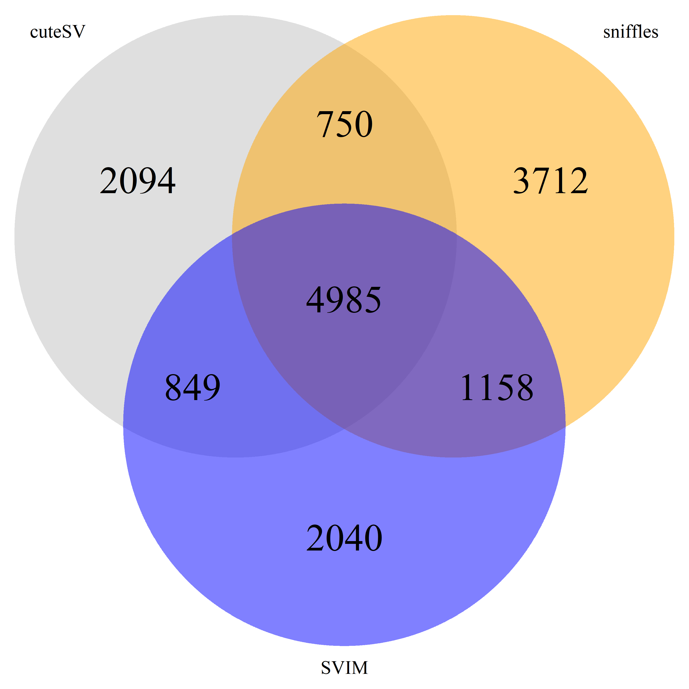
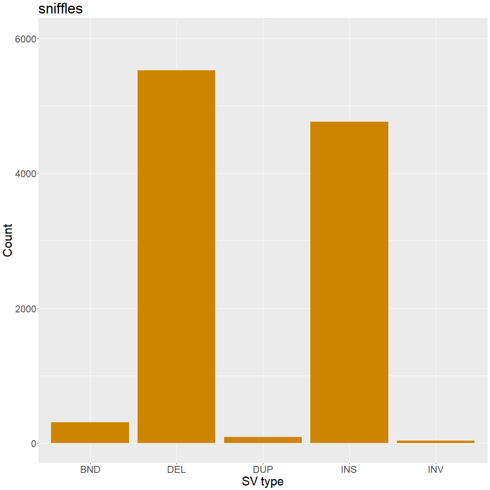
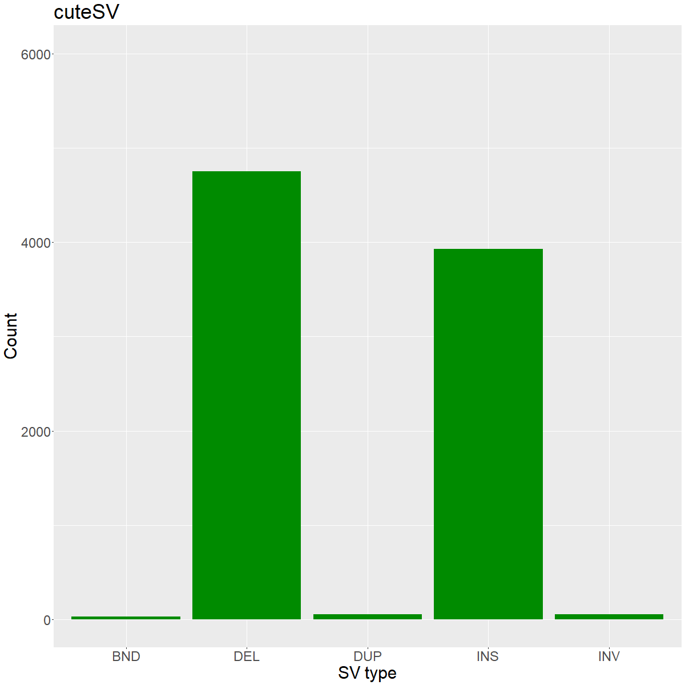
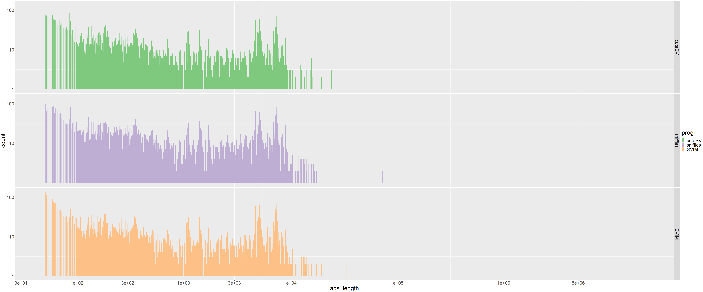

# Final report

## Intro

The preliminary tests were performed on nanopore data from Emerson's lab, generated in 2018. Two stategies of SV calling, mapping based & assembly-based, were examinated. 

## average of assembly size

Genomes of fruit flies were assembled by `Flye` and `Canu` respectively and merged together. 

## SV calling

The used programs were `SVIM`, `cuteSV`, `sniffles`, `SVIM-asm`, and `Assembelytics`. In the tests, each program yielded around 8000-10000 SV candidates from one individual after adequate quality filtration. In contrast, there were around 50000-55000 biallelic SNPs from one genome. The types of SVs include inversion, insertion, deletion, duplication, and translocation. Complex SVs are still hard to detect. The VCF file of each program were compared and different distance threasholds were used to define identity. We can find around 5000 consensus SVs detected by three programs (Fig. 1). 

## Distribution

Utilizing the infotags, the length and types of SVs can be extracted from _VCF_ files. We observed much more insertions and deletions than other types. (Fig. 2) The length distributions of all SVs from some programs were plotted. We cound see that the peaks and shapes were similar. (Fig. 3) 

#### Figure.1

|||
|---|---|
|||

#### Figure.2 

#### Figure.3